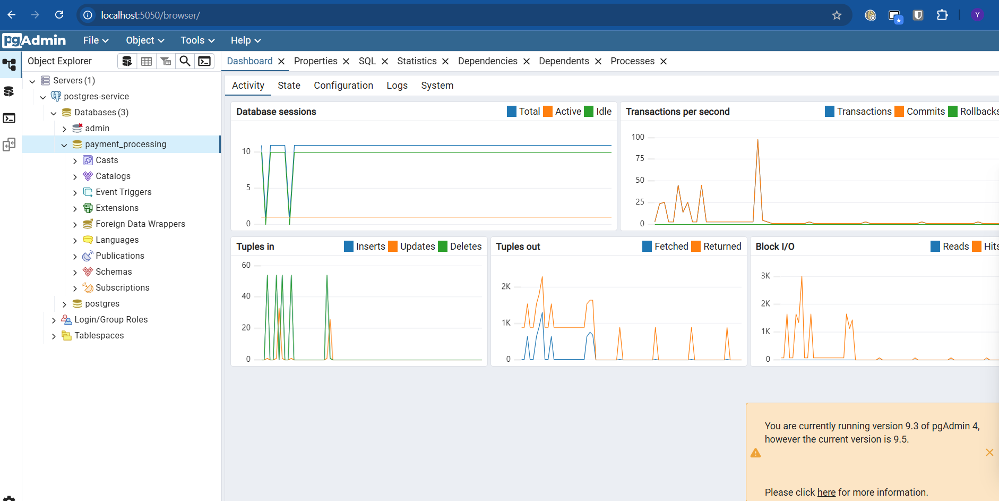
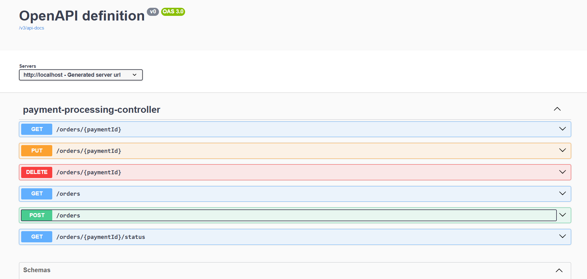

# Payment Processing Service

A Spring Boot-based microservice for ingesting, processing, and managing payment orders with Kafka and PostgreSQL integration.

---

## Table of Contents
- [Overview](#overview)
- [Architecture](#architecture)
- [Setup](#setup)
- [API Endpoints](#api-endpoints)
- [Sample Payloads](#sample-payloads)
- [Screenshots](#screenshots)
- [Testing](#testing)
- [Swagger UI](#swagger-ui)
- [Environment Variables](#environment-variables)
- [Supported Providers](#supported-providers)

---

## Overview
This service allows clients to submit payment orders, query their status, update, and cancel them. It uses Kafka for event-driven processing and PostgreSQL for persistence. Supported providers include CBE and Telebir.

## Architecture
- **Spring Boot** (Java 22)
- **PostgreSQL** (via Docker)
- **Kafka** (via Docker)
- **Swagger/OpenAPI** for API documentation

## Setup

1. **Start dependencies:**
   ```sh
   docker-compose up -d
   ```
2. **Access pgAdmin:**
   - Go to [http://localhost:5050/browser/](http://localhost:5050/browser/)
   - Connect UI to the database using:
     - Host: `localhost`
     - Port: `5432`
     - User: `admin`
     - Password: `admin`
3. **Create the database:**
   - Name: `payment_processing`
4. **Kafka topics:**
   - Uncomment Kafka config in the code for topic creation on first run. Comment it out for subsequent runs.
5. **Run the application:**
   ```sh
   ./mvnw spring-boot:run
   ```

## API Endpoints
Base path: `/api/v1/processing`

| Method | Endpoint                        | Description                        |
|--------|----------------------------------|------------------------------------|
| POST   | `/orders`                       | Ingest a new payment order         |
| GET    | `/orders/{paymentId}/status`    | Get status of a payment order      |
| GET    | `/orders/{paymentId}`           | Get details of a payment order     |
| GET    | `/orders`                       | List all payment orders            |
| PUT    | `/orders/{paymentId}`           | Update a payment order             |
| DELETE | `/orders/{paymentId}`           | Cancel a payment order             |

### Example: Ingest Payment Order
```json
POST /api/v1/processing/orders
Content-Type: application/json
{
  "provider": "CBEProvider",
  "orderNumber": "<optional, generated if omitted>",
  "paymentRequestDto": {
    // Add payment-specific fields here
  }
}
```

### Example: Get Payment Status
```http
GET /api/v1/processing/orders/{paymentId}/status
```

## Sample Payloads
```json
{
  "provider": "cbe",
  "orderNumber": "1234567890",
  "paymentRequestDto":
  {
    "customerId": "cust_67890",
    "amount": 250.75,
    "paymentMethod": "telebir",
    "paymentProvider": "yaya"
  }
}
```


```json
{
  "provider": "telebir",
  "orderNumber": "1234567890",
  "paymentRequestDto": {
    "customerId": "cust_67890",
    "amount": 250.75,
    "paymentMethod": "telebir",
    "paymentProvider": "yaya"
  }
}
```

## Testing
- Standard Spring Boot tests can be added under `src/test/java`.
- To run tests:
  ```sh
  ./mvnw test
  ```

## Swagger UI
- API documentation is available at: [http://localhost/swagger-ui/index.html](http://localhost/swagger-ui/index.html)

## Environment Variables
- `PG_HOST`, `PG_PORT`, `PG_DATABASE`, `PG_USERNAME`, `PG_PASSWORD` for database config
- `KAFKA_*` for Kafka config

## Supported Providers
- CBEProvider
- TelebirProvider

---
For more details, see the source code or contact the maintainer.




